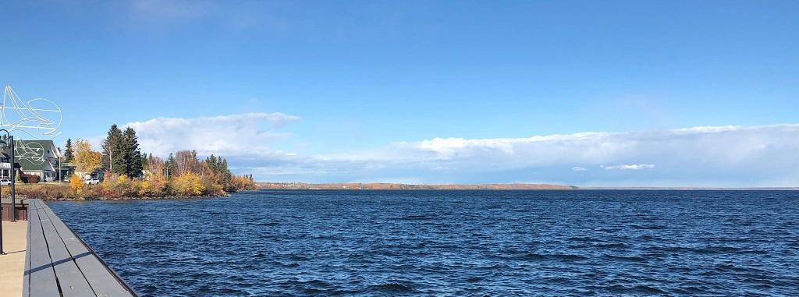

# About David

David is a sysadmin with over 20 years of experience managing Windows Servers, and is also a [Microsoft Certified: Azure Administrator Associate](https://www.youracclaim.com/badges/82c18969-c7c0-4f9b-a644-c19a150821c3/public_url). Finding solutions to meet the needs of his clients by applying his years of experience and love of learning new technologies is one of the things he enjoys most about his career in IT. He is currently working for [GMS](https://www.gms.ca) as a Systems Administrator where he brings his passion for IT, tells the not so occasional dad joke, and works with like-minded peers.

David resides in Alberta, Canada, and is spends his free time learning new technologies, blogging, and pursuing the Azure Architect certification.

You can follow David at any or all of the following, although Twitter is probably best:

- [Twitter](https://twitter.com/fuselamb) I hope you like dad jokes!
- [LinkedIn](https://www.linkedin.com/in/davidlamb/) 
- [GitHub](https://github.com/fuselamb) (wait...that's here)
- [TechSnips](https://techsnips.io/contributors/david-lamb/)
- [Blog: The Frozen Geek](http://thefrozengeek.blogspot.com/) His technical blog.
- [Blog: David's Two Cents](http://ourtwocents-david.blogspot.com/) His personal, sadly neglected blog.

